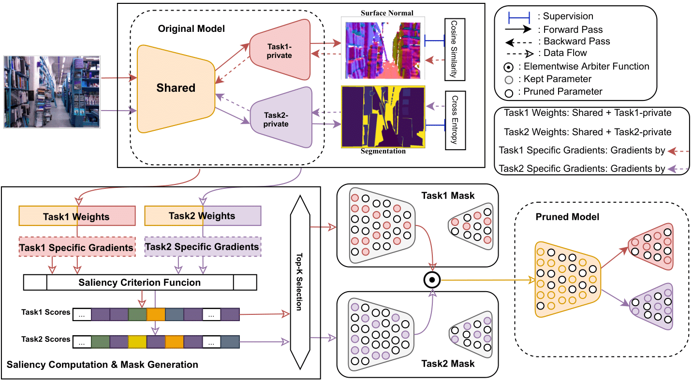
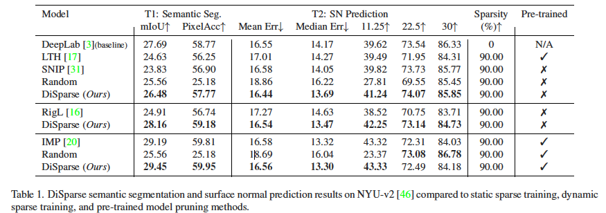
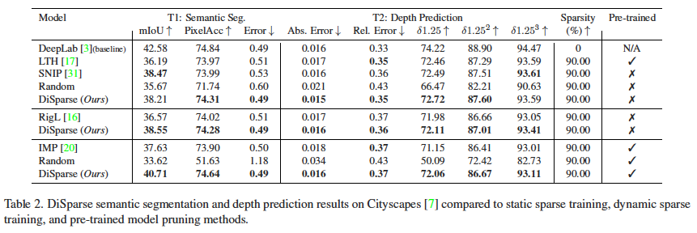
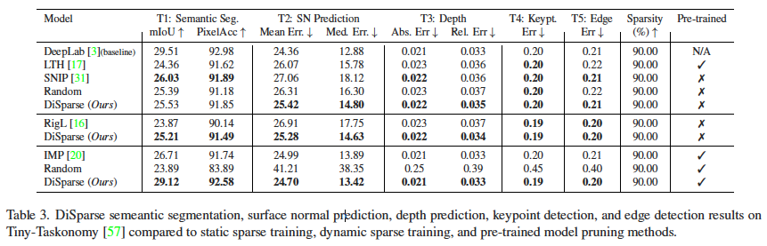
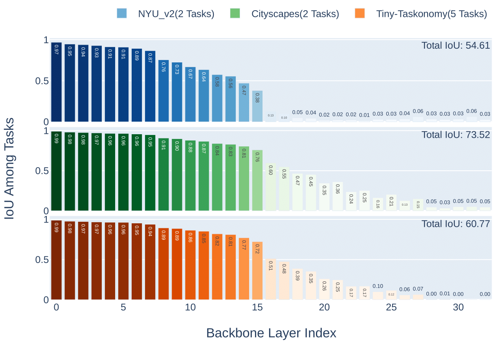

# DiSparse: Disentangled Sparsification for Multitask Model Compression

This repository is for DiSparse method introduced in the following paper accepted by CVPR2022:

DiSparse: Disentangled Sparsification for Multitask Model Compression\
Xinglong Sun, Ali Hassani, Zhangyang Wang, Gao Huang, Humphrey Shi

## Introduction
Despite the popularity of Model Compression and Multitask Learning, how to effectively compress a multitask model has been less thoroughly analyzed due to the challenging entanglement of tasks in the parameter space. In this paper, we propose DiSparse, a simple, effective, and first-of-its-kind multitask pruning and sparse training scheme. We consider each task independently by disentangling the importance measurement and take the unanimous decisions among all tasks when performing parameter pruning and selection. Our experimental results demonstrate superior performance on various configurations and settings compared to popular sparse training and pruning methods. Besides the effectiveness in compression, DiSparse also provides a powerful tool to the multitask learning community. Surprisingly, we even observed better performance than some dedicated multitask learning methods in several cases despite the high model sparsity enforced by DiSparse. We analyzed the pruning masks generated with DiSparse and observed strikingly similar sparse network architecture identified by each task even before the training starts. We also observe the existence of a "watershed" layer where the task relatedness sharply drops, implying no benefits in continued parameters sharing. 

<div align="center">
  
  Overview of our method.
</div>

## Prerequisites
### Datasets
For NYU-V2, please download here:\
https://drive.google.com/file/d/11pWuQXMFBNMIIB4VYMzi9RPE-nMOBU8g/view

For CityScapes, please download here:\
https://drive.google.com/file/d/1WrVMA_UZpoj7voajf60yIVaS_Ggl0jrH/view

For Tiny-Taskonomy, please refer to the following page for instructions:\
https://github.com/StanfordVL/taskonomy/tree/master/data

## Train Baseline
To train the baseline/unpruned network, run:
```
python3 launch_training.py --dataset [DATASET] --method baseline --dest [DEST]
```
Example:
```
python3 launch_training.py --dataset nyuv2 --method baseline --dest "/data/"
```
## Create Pruned Model
To generate sparsified model from pretrained checkpoint or from scratch, run:
```
python3 create_pruned_net.py --dataset [DATASET] --num_batches [NUM_BATCHES] --method [METHOD] --ratio [RATIO] --dest [DEST]
```
Example:
```
python3 create_pruned_net.py --dataset nyuv2 --num_batches 50 --method disparse_static --ratio 90 --dest "/data"
```
## Train Sparsified
To train the sparsified network generated in the above step or use dynamic sparsity training, run:
```
python3 launch_training.py --dataset [DATASET] --method [METHOD] --ratio [RATIO] --dest [DEST]
```
Example:
```
python3 launch_training.py --dataset nyuv2 --method disparse_dynamic --ratio 90 --dest "/data"
```
Available options for method are: disparse_static, disparse_pt, disparse_dynamic
## Evaluate
To evaluate the sparsified model, run:
```
python3 eval_pruned_net.py --dataset [DATASET] --method [METHOD] --ratio [RATIO]
```
Example:
```
python3 eval_pruned_net.py --dataset nyuv2 --method disparse_static --ratio 90
```
### Pretrained Models
Pretrained sparsified models can be downloaded here: https://drive.google.com/drive/folders/1wHKdjXkiOQjiKJGkXdUlvBe2oOQzFkJY?usp=sharing

## IoU Analysis
To perform the Mask IoU Analysis we mentioned in the Discussion section of the paper, you may refer to iou_analysis.py and iou_visualize.ipynb.
To run iou_analysis.py:
```
python3 iou_analysis.py --dataset [DATASET]
```
Example:
```
python3 iou_analysis.py --dataset nyuv2
```

## Results
<div align="center">
  
  Results on NYU-v2.
</div>
<div align="center">
  
  Results on Cityscapes.
</div>
<div align="center">
  
  Results on Tiny-Taskonomy.
</div>
<div align="center">
  
  IoU on Tasks Across Backbone Layers.
</div>

## Acknowledgement
Some dataloading and evaluation code is from:
https://github.com/sunxm2357/AdaShare

## Citations
If you find this repo useful to your project or research, please cite our paper below:

@inproceedings{sun2022disparse,\
  title={DiSparse: Disentangled Sparsification for Multitask Model Compression},\
  author={Sun, Xinglong and Hassani, Ali and Wang, Zhangyang and Huang, Gao and Shi, Humphrey},\
  booktitle={Proceedings of the IEEE/CVF Conference on Computer Vision and Pattern Recognition},\
  pages={12382--12392},\
  year={2022}
}